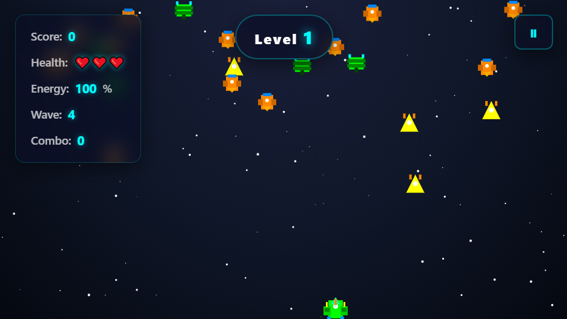

# Galactic Defender

FREE [Plastine](https://www.plastine.com/)!

A thrilling space shooter game built with Next.js, React, and TypeScript. Defend the galaxy from waves of enemy invaders in this action-packed arcade-style game!



## Play the Game

Want to jump right in? **[Play Galactic Defender online here!](https://galactic-defender-two.vercel.app/)**

## Features

- **Multiple Enemy Types**: Face basic, fast, tank, and boss enemies
- **Power-ups and Abilities**:
  - Shield protection
  - Triple shot
  - Rockets and smart rockets
  - Laser beams
  - Nuclear strikes
  - Health regeneration
  - Speed boosts
  - Magic attacks
- **Progressive Difficulty**: Increasing waves with more enemies and challenges
- **Scoring System**: Combo multipliers and high scores
- **Responsive Design**: Play on desktop with keyboard controls
- **Particle Effects**: Explosions, sparkles, and visual feedback
- **Boss Battles**: Epic encounters with powerful enemies

## Installation

1. Clone the repository:
```bash
git clone <repository-url>
cd galactic-defender-
```

2. Install dependencies:
```bash
npm install
# or
pnpm install
# or
yarn install
```

3. Run the development server:
```bash
npm run dev
# or
pnpm dev
# or
yarn dev
```

4. Open [http://localhost:3000](http://localhost:3000) in your browser to play the game.

## Controls

- **Arrow Keys** or **WASD**: Move your spaceship
- **Spacebar**: Shoot bullets
- **R**: Fire rocket
- **T**: Smart rocket (homing)
- **Q**: Activate shield
- **E**: Laser attack
- **X**: Nuclear strike
- **H**: Health regeneration
- **B**: Speed boost
- **M**: Magic attack (increased damage)
- **P**: Pause game
- **Enter**: Start game (from menu)

## Gameplay

- **Objective**: Survive waves of enemies and achieve the highest score possible
- **Health**: You have 3 lives - lose them all and it's game over
- **Energy**: Powers special abilities - regenerates over time
- **Combos**: Chain enemy kills for score multipliers
- **Waves**: Each wave brings more enemies and tougher challenges

## Technologies Used

- **Next.js 14** - React framework
- **TypeScript** - Type safety
- **Tailwind CSS** - Styling
- **shadcn/ui** - UI components
- **Canvas API** - Game rendering
- **React Hooks** - State management

## Project Structure

```
galactic-defender-/
├── app/                    # Next.js app directory
│   ├── layout.tsx         # Root layout
│   ├── page.tsx           # Main game component
│   ├── game.module.css    # Game-specific styles
│   └── globals.css        # Global styles
├── components/             # Reusable components
│   ├── ui/                # shadcn/ui components
│   └── theme-provider.tsx # Theme provider
├── hooks/                  # Custom React hooks
├── lib/                    # Utility functions
├── public/                 # Static assets
├── styles/                 # Additional styles
└── package.json            # Dependencies and scripts
```

## Building for Production

```bash
npm run build
npm start
```

## Contributing

1. Fork the repository
2. Create a feature branch (`git checkout -b feature/amazing-feature`)
3. Commit your changes (`git commit -m 'Add some amazing feature'`)
4. Push to the branch (`git push origin feature/amazing-feature`)
5. Open a Pull Request

## License

This project is licensed under the MIT License - see the [LICENSE](LICENSE) file for details.

## Acknowledgments

- Built with [Next.js](https://nextjs.org/)
- UI components from [shadcn/ui](https://ui.shadcn.com/)
- Icons from [Lucide React](https://lucide.dev/)

---

**Enjoy defending the galaxy! 🚀**

---

Made by laadnani — hosted for free on (https://galactic-defender-two.vercel.app/) 
